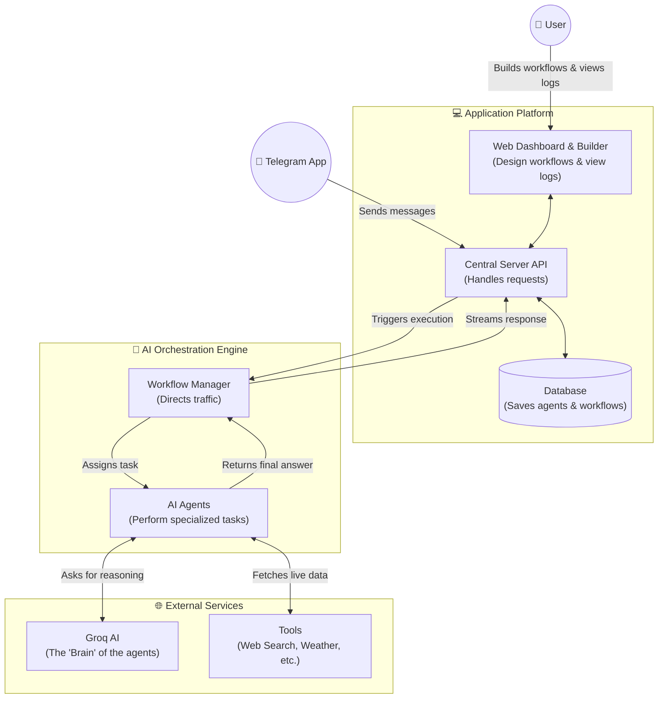

# AgentOrch: AI Agent Orchestration Platform

A local-first, production-grade platform for designing, managing, and executing autonomous multi-agent workflows using LangGraph and Groq LLMs.

---

## 📺 Demo

Check out the platform in action:
[](https://youtu.be/SK0MhaYiB8g)

---


## Architecture Overview



### Component Details
- **Frontend**: A Next.js application leveraging React Flow to provide a visual canvas for drag-and-drop workflow building.
- **Backend**: Built on FastAPI. Handles API requests, background task execution, and real-time log streaming via WebSockets.
- **Runtime**: Uses **LangGraph** to compile dynamic `StateGraph` workflows from the database configurations.
- **Telegram Bot**: Operates as a background polling service, translating user messages into workflow triggers.

### Runtime Choice Justification
We selected **LangGraph** over alternatives like CrewAI or AutoGen because it provides precise, deterministic control over the agent state machine. Multi-agent workflows often suffer from infinite loops or unpredictable routing; LangGraph's declarative edge routing and shared `AgentState` eliminate these issues while still supporting autonomous tool execution.

---

## Setup Instructions

### Prerequisites
- Python 3.10+
- Node.js 18+
- Groq API Key
- Telegram Bot Token (optional)

### 1. Environment Configuration
Create a `.env` file in the root directory:
```env
GROQ_API_KEY=your_groq_api_key_here
TELEGRAM_BOT_TOKEN=your_telegram_bot_token_here
DATABASE_URL=sqlite:///./sql_app.db
CORS_ORIGINS=http://localhost:3000,http://127.0.0.1:3000
```

### 2. Backend Setup
```bash
cd backend
python -m venv .venv
# Activate the virtual environment
# Windows: .venv\Scripts\activate
# Mac/Linux: source .venv/bin/activate

pip install -r requirements.txt
python seed.py  # Populates SQLite with default templates
uvicorn app.main:app --reload
```
The API will be available at `http://localhost:8000`.

### 3. Frontend Setup
```bash
cd frontend
npm install
npm run dev
```
The UI will be available at `http://localhost:3000`.

---

## Execution Guide

1. **Dashboard**: Visit `http://localhost:3000` to view execution histories.
2. **Agent Management**: Navigate to the **Agents** tab to create or edit LLM configurations, assigning them tools and system prompts.
3. **Workflow Builder**: Navigate to the **Builder** tab. Drag agents, triggers, and condition nodes onto the canvas. Connect them to form an execution path, then save the workflow.
4. **Triggering**: Trigger a workflow directly from the dashboard by clicking "Execute", or send a message to your Telegram bot.
5. **Real-Time Logs**: Watch the expandable logs in the dashboard to see agents communicating and executing tools synchronously.

---

## Extensibility Guide

### Adding New Tools
1. Open `backend/app/core/tools.py`.
2. Define a new Python function annotated with LangChain's `@tool` decorator.
3. Add the function to the `AVAILABLE_TOOLS` dictionary at the bottom of the file.
4. Restart the backend.

### Adding Workflow Templates
1. Open `backend/seed.py`.
2. Define a new workflow configuration block inside the `seed_data()` function using existing agent IDs.
3. Run `python seed.py` to upsert the template into your database.

### Adding New Messaging Channels
1. Create a new file under `backend/app/messaging/` (e.g., `discord_bot.py`).
2. Write a listener function that receives a message and calls `run_workflow_bg(workflow_id, execution_id, input_message, thread_id)`.
3. Import and initialize the background listener in `backend/app/main.py` lifespan context manager.
